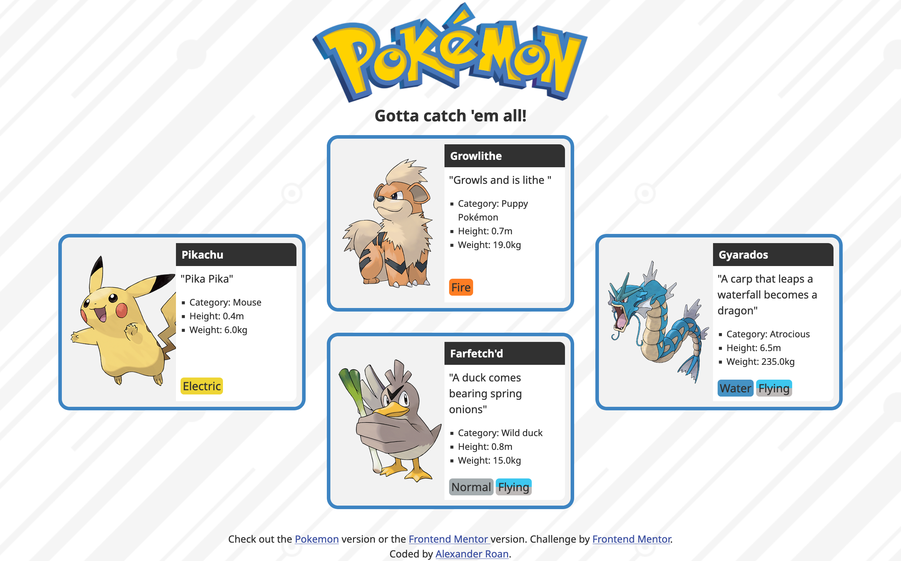
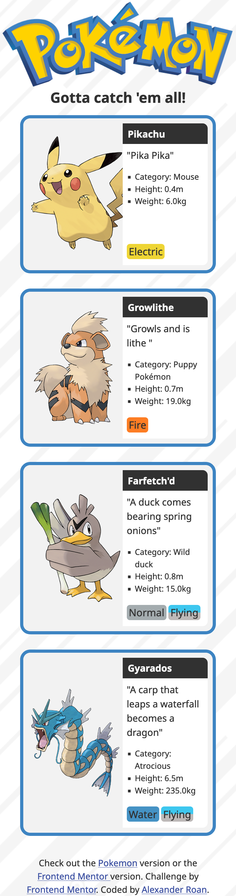

# Frontend Mentor - Four card feature section solution

This is a solution to the [Four card feature section challenge on Frontend Mentor](https://www.frontendmentor.io/challenges/four-card-feature-section-weK1eFYK). Frontend Mentor challenges help you improve your coding skills by building realistic projects. 

## Table of contents

- [Overview](#overview)
  - [The challenge](#the-challenge)
  - [Screenshot](#screenshot)
  - [Links](#links)
- [My process](#my-process)
  - [Built with](#built-with)
  - [What I learned](#what-i-learned)
  - [Continued development](#continued-development)
  - [Useful resources](#useful-resources)
- [Author](#author)
- [Acknowledgments](#acknowledgments)

**Note: Delete this note and update the table of contents based on what sections you keep.**

## Overview

### The challenge

Users should be able to:

- View the optimal layout for the site depending on their device's screen size

### Screenshot

### Links

Note the solution has two version. Use the link in the attribution text to switch to the version for the exercise instructions.

- Solution URL: [Github Repo](https://dearestalexander.github.io/fm-four-card/)
- Live Site URL: [Github Pages](https://github.com/dearestalexander/fm-four-card)

## My process

### Built with

Plain old HTML and CSS, but using both flex and grid.

As the desktop layout is slightly more complex it's desktop first with @media for mobile. But both were designed in parallel.

### What I learned

I haven't used grid that much in my practice to date, so this was a good opportunity to play around with positioning of grid items.
I also found flex very useful to position the icons.

### Continued development

I took the opportunity to make my own side design, stealing some assets from the Pokemon website!

### Useful resources

## Author

- Website - [Alexander Roan](https://www.alexroan.com)
- Frontend Mentor - [@dearestalexander](https://www.frontendmentor.io/profile/dearestalexander)
- Twitter - [@xander_roan](https://x.com/xander_roan)

## Acknowledgments

Thanks to the team at Frontend Mentor
